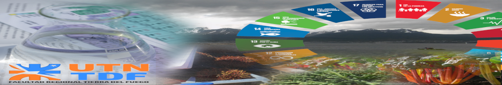
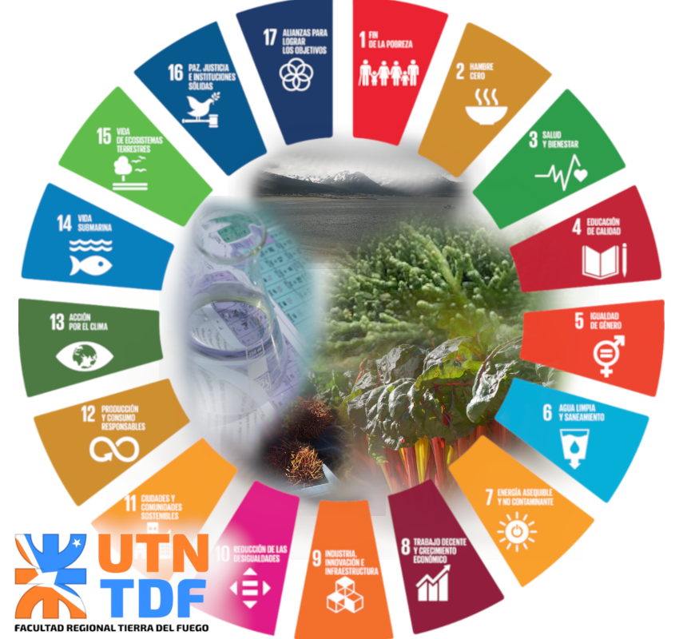
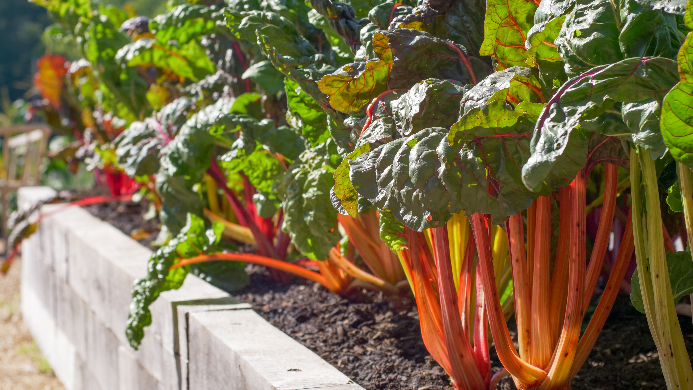
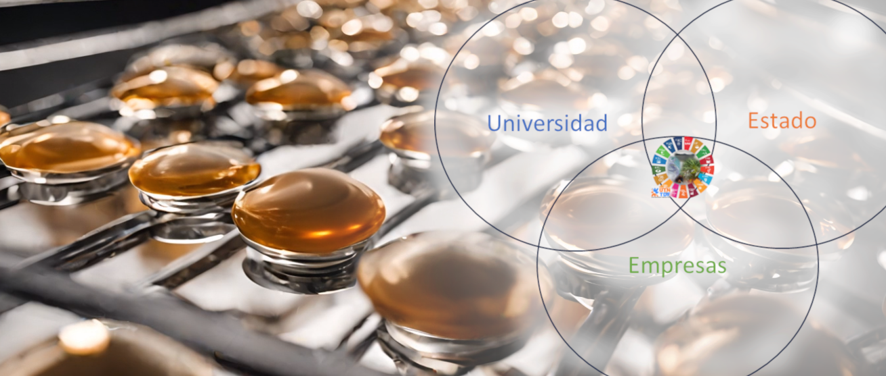
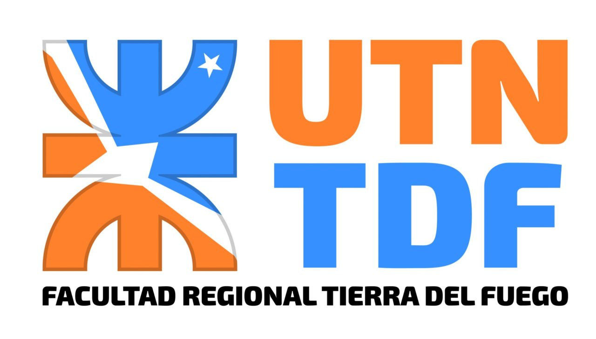

 

# QA3DS

### Química Aplicada al Ambiente, los Alimentos y el Desarrollo Sostenible

**Grupo de Investigación, Desarrollo e Innovación**

---

*Ushuaia y Río Grande, Tierra del Fuego, Argentina 🇦🇷*

---

## 🔬 ¿Quiénes somos?

**QA3DS** es un grupo de investigación de la [Universidad Tecnológica Nacional — Facultad Regional Tierra del Fuego](https://www.frtdf.utn.edu.ar/) dedicado a la **investigación, desarrollo e innovación** en áreas estratégicas para la provincia más austral del mundo:

- 🧪 **Química aplicada** al análisis de alimentos y recursos naturales
- 🌿 **Ambiente** y uso sustentable de recursos naturales patagónicos
- 🍽️ **Alimentos** — agregado de valor a productos regionales
- ♻️ **Desarrollo sostenible** — soberanía alimentaria y economía local

> *"Contribuir al conocimiento y avance científico en Tierra del Fuego mediante I+D+I en áreas estratégicas: soberanía alimentaria, uso sustentable de recursos naturales, ambiente y desarrollo sostenible, formando recursos humanos de calidad en ingeniería."*

---

## 🎯 Misión, Visión y Valores

<table>
<tr>
<td width="50%">

### 🧭 Misión
Contribuir al conocimiento y avance científico en **Tierra del Fuego** mediante investigación, desarrollo e innovación en áreas estratégicas: **soberanía alimentaria**, uso sustentable de recursos naturales, ambiente y desarrollo sostenible, formando **recursos humanos de calidad** en ingeniería.

### 🔭 Visión
Ser **referente regional** en I+D+I para la toma de decisiones en gestión de recursos, referente técnico para oportunidades de mercado local, fuente de conocimiento para startups y empresas de base tecnológica.

</td>
<td width="50%">

### 💎 Valores
1. Responsabilidad social y ambiental
2. Vocación por la innovación
3. Excelencia académica
4. Cooperación y trabajo interdisciplinario
5. Honestidad y confiabilidad
6. Ética, responsabilidad y capacidad de trabajo
7. Valentía para aceptar nuevos desafíos

</td>
</tr>
</table>

---

## 🧫 Proyectos

### 🟢 PID PP9884 — Liofilización de Alimentos Regionales

<table>
<tr>
<td width="35%">

<em>Ruibarbo patagónico — materia prima regional</em>

</td>
<td width="65%">

**Análisis del Proceso de Liofilizado Aplicado a Alimentos de Producción Local/Regional en la Provincia de Tierra del Fuego**

| | |
|---|---|
| **Código** | PIDPP PP9884 |
| **Período** | Abril 2023 — En ejecución (prorrogado) |
| **Director** | Ing. Pesq. Ariel Luján Giamportone |
| **Financiamiento** | UTN — Secretaría de Ciencia y Tecnología |

</td>
</tr>
</table>

#### ¿Qué hacemos?

Estudiamos la **liofilización** (freeze-drying) como técnica innovadora de conservación de alimentos, aplicándola a productos de la flora y fauna de Tierra del Fuego. La liofilización preserva hasta el **97% de los nutrientes** originales, eliminando el agua por sublimación sin degradar el producto.

#### Objetivos principales

- 🔬 Generar **know-how** sobre productos regionales con potencial comercial
- 📊 Optimizar **parámetros de liofilización** (temperatura, presión, tiempo)
- 🏭 Diseñar un **liofilizador modular** adaptable a escalas de producción regionales
- 🤝 **Transferir** conocimiento y tecnología al sector socioproductivo de TDF
- 📈 Evaluar la **factibilidad de escalado** a planta piloto y semi-industrial

#### Resultados destacados

- ✅ **4 experimentos** completados con ruibarbo patagónico (*Rheum rhabarbarum* L.)
- ✅ Tiempo óptimo de liofilización identificado: **36 horas**
- ✅ Humedad original del ruibarbo fresco: **~94.4% BH** (base húmeda)
- ✅ **2 artículos** de divulgación publicados en [Revista La Lupa](https://www.cadic-conicet.gob.ar/la-lupa/)
- ✅ Estudio completo de **escalado y factibilidad económica**
- ✅ Convenio de colaboración con **Estancia Viamonte** (producción local)

---

## 👥 Equipo

### Investigadores docentes

| Nombre | Especialidad | Rol |
|---|---|---|
| **Ing. Pesq. Ariel Luján Giamportone** | Ingeniería Pesquera | Director del grupo |
| **Ing. Quím. Pamela Rocío Flores** | Ingeniería Química | Investigadora |
| **Ing. Quím. María Victoria Cornejo** | Ingeniería Química | Investigadora |
| **Ing. Industrial Javier Alfarano** | Ingeniería Industrial | Investigador de Apoyo |
| **Dra. Milagro Mottola** | Doctora en Química | Investigadora |
| **Dr. Tomás Chalde** | Doctor en Ciencias | Investigador de Apoyo |

### Alumnos investigadores (2025)

7 alumnos activos de las carreras de **Ingeniería Química**, **Ingeniería Electromecánica** e **Ingeniería Pesquera** de UTN FRTDF, con becas BINID y Gabriel y Jorge.

---

## 📚 Publicaciones

| Año | Publicación | Tipo |
|---|---|---|
| 2025 | *"Química Aplicada al Ambiente, los Alimentos y el Desarrollo Sostenible: Investigando la Liofilización en Tierra del Fuego"* — Revista La Lupa | Divulgación |
| 2025 | *"Liofilización: Conservando el Futuro Alimentario de Tierra del Fuego"* — Revista La Lupa | Divulgación |
| 2023 | Presentación en Jornadas de Ciencia y Tecnología UTN FRTDF | Conferencia |

---

## 🤝 Alianzas y colaboraciones

<table>
<tr>
<td align="center" width="25%"><strong>Estancia Viamonte</strong> <em>Materias primas y entorno productivo</em></td>
<td align="center" width="25%"><strong>CADIC-CONICET</strong> <em>Capacitación y equipamiento</em></td>
<td align="center" width="25%"><strong>IIByT (CONICET-UNC)</strong> <em>Análisis DVS (actividad de agua)</em></td>
<td align="center" width="25%"><strong>CIATI</strong> <em>Microbiología y rotulado</em></td>
</tr>
</table>

---

## 📫 Contacto

| | |
|---|---|
| 💼 **LinkedIn** | [QA3DS](https://www.linkedin.com/company/qu%C3%ADmica-aplicada-al-ambiente-los-alimentos-y-el-desarrollo-sostenible) |
| 🔬 **ResearchGate** | [QA3DS Lab](https://www.researchgate.net/lab/Quimica-aplicada-al-Ambiente-los-Alimentos-y-el-Desarrollo-Sostenible-Ariel-Lujan-Giamportone) |
| 🏛️ **Institución** | [UTN — Facultad Regional Tierra del Fuego](https://www.frtdf.utn.edu.ar/) |
| 📍 **Ubicación** | Ushuaia y Río Grande, Tierra del Fuego, Argentina |
| 🐙 **GitHub** | [@QA3DS](https://github.com/QA3DS) |

---

&nbsp;&nbsp;&nbsp;&nbsp;&nbsp;

  

*Grupo QA3DS — UTN FRTDF — Ciencia y tecnología desde el fin del mundo 🌎*

Universidad Tecnológica Nacional — Facultad Regional Tierra del Fuego — Secretaría de Ciencia y Tecnología

